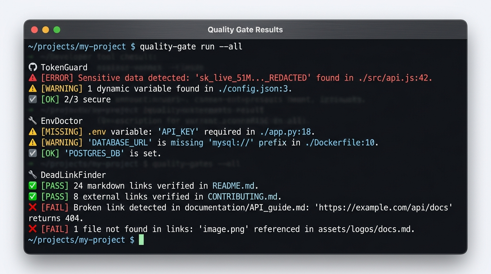

# TokenGuard 🛡️

[](https://pypi.org/project/tokenguard-cli/)
[](https://pypi.org/project/tokenguard-cli/)
[](https://github.com/umutgungorr/tokenguard/actions/workflows/ci.yml)
[](https://github.com/pre-commit/pre-commit)
[](https://docs.github.com/en/code-security/code-scanning)
[](https://www.python.org/downloads/)
[](https://opensource.org/licenses/MIT)
[]()

> **Lightweight, zero-dependency Git pre-commit secret scanner with native SARIF & baseline suppression.**  
> Prevent accidental leaks of API tokens, cloud credentials, private keys, and high-entropy secrets *before* they hit your Git history or pull requests.

<p align="center">
  
</p>

```text
$ tokenguard --staged

🛡️ TokenGuard v0.2.0 — Scanning staged Git changes...
[!] SEC-001  CRITICAL  AWS Access Key ID in 'config/storage.py:14'
    Value: AKIA************4TE7  (Entropy: 4.31)
    Action: Rotate credential immediately and load via environment variable.

[!] SEC-003  CRITICAL  GitHub Personal Access Token in '.env.local:2'
    Value: ghp_************14TeR  (Entropy: 4.65)
    Action: Revoke token from GitHub Developer Settings.

[✗] 2 unbaselined secrets detected across 2 files. Commit aborted (exit 1).
    (To suppress accepted mock/test credentials, run: tokenguard --update-baseline)
```

---

## 🌟 Why TokenGuard?

Accidentally committing secrets (API keys, private keys, cloud tokens) to Git repositories is one of the most widespread security vulnerabilities. Once pushed, revoking tokens and rewriting Git history is costly, noisy, and error-prone.

**TokenGuard** delivers enterprise-ready secret prevention in a lightweight, zero-runtime-dependency Python package:
- **Zero External Dependencies**: Built strictly on the Python Standard Library (`re`, `math`, `argparse`, `pathlib`, `hashlib`, `json`, `subprocess`).
- **Native SARIF v2.1.0**: Generates standard OASIS SARIF reports directly consumable by GitHub Code Scanning Alerts and CI security dashboards.
- **Fingerprinted Baseline Suppression**: Generate a `.tokenguard.baseline` file to grandfather existing legacy or test mock keys without breaking CI builds.
- **Actionable Remediation & Confidence**: Findings include granular confidence ratings (`HIGH`, `MEDIUM`, `LOW`) and exact remediation steps (e.g. key rotation guides).
- **Deterministic Exit Codes**: Seamlessly integrates into CI/CD pipelines (`0` = clean, `1` = unbaselined secrets, `2` = argument / I/O error).
- **Safe Output Masking**: Secrets are automatically masked (e.g. `ghp_************14TeR`) to avoid leaking values into CI terminal logs.

---

## 🔍 Supported Secret Signatures

| Rule ID | Name | Severity | Confidence | Description |
|---------|------|----------|------------|-------------|
| `SEC-001` | AWS Access Key ID | CRITICAL | HIGH | AWS IAM & STS access keys (`AKIA...`, `ASIA...`) |
| `SEC-002` | AWS Secret Access Key | CRITICAL | HIGH | Declared AWS secret access key pairs |
| `SEC-003` | GitHub Access Token | CRITICAL | HIGH | Classic and fine-grained GitHub tokens |
| `SEC-004` | Generic Private Key | HIGH | HIGH | RSA, DSA, EC, OPENSSH private keys |
| `SEC-005` | High Entropy String | MEDIUM | LOW | Random base64/hex strings commonly used as secrets |

---

## 🚀 Quick Start

### Installation

```bash
pip install tokenguard-cli
```

### Pre-commit Hook (Recommended)

Add this to your `.pre-commit-config.yaml`:

```yaml
repos:
  - repo: https://github.com/umutgungorr/tokenguard
    rev: v0.2.0
    hooks:
      - id: tokenguard
```

### Manual Usage

```bash
# Scan a specific directory
tokenguard scan ./src

# Scan all staged files
tokenguard --staged

# Generate SARIF report for GitHub Advanced Security
tokenguard scan ./src --format sarif --output results.sarif
```

---

## 📝 License

This project is licensed under the MIT License - see the [LICENSE](LICENSE) file for details.
